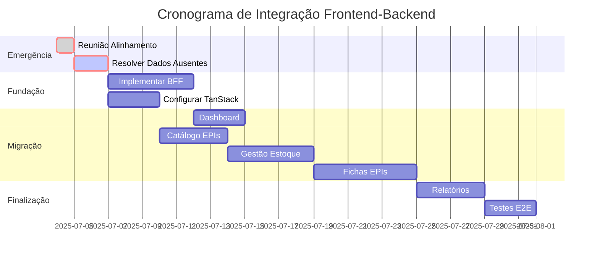

# 🚨 Análise Crítica: Integração Frontend Svelte vs Backend EPI 3.5

**Data**: 04 de julho de 2025  
**Status**: 🔴 **EMERGÊNCIA DE INTEGRAÇÃO**  
**Prioridade**: CRÍTICA - Ação imediata requerida

---

## 📊 Resumo Executivo

Após análise profunda comparando o frontend Svelte atual com as especificações do Backend EPI 3.5, foi identificada uma **incompatibilidade fundamental** que impede a integração direta. O problema vai além de ajustes de API - são **diferenças arquiteturais irreconciliáveis** que requerem intervenção imediata.

### Status Geral
- ✅ **Backend EPI 3.5**: 97% completo, conforme especificação técnica
- ❌ **Frontend Svelte**: 0% compatível com backend real
- 🚫 **Integração**: **IMPOSSÍVEL** sem refatoração massiva

---

## 🔍 Problemas Críticos Identificados

### 1. 🗃️ **DADOS AUSENTES NO BACKEND**

**Problema**: Frontend requer campos que não existem no schema do backend.

```typescript
// ❌ FRONTEND ESPERA (src/lib/types/index.ts)
interface TipoEPI {
  id: string;
  numeroCA: string;
  nomeEquipamento: string;
  categoria: string;     // ❌ NÃO EXISTE no backend
  fabricante: string;    // ❌ NÃO EXISTE no backend
  vidaUtilDias: number;
}

// ✅ BACKEND TEM (Specs EPI 3.5)
tipos_epi {
  id: uuid,
  nome_equipamento: varchar(255),
  numero_ca: varchar(50),
  vida_util_dias: integer,
  status: status_tipo_epi_enum
  -- categoria e fabricante NÃO EXISTEM
}
```

**Impacto**: UI não pode ser renderizada sem esses dados essenciais.

### 2. 🔄 **PADRÕES DE INTERAÇÃO INCOMPATÍVEIS**

**Problema**: Frontend usa CRUD direto, backend requer Use Cases formais.

```typescript
// ❌ FRONTEND FAZ (src/lib/services/api.ts)
export const estoqueExtendedAPI = {
  async updateQuantidade(id: string, quantidade: number, motivo: string) {
    await apiRequest(`/itens-estoque/${id}/quantidade`, { 
      method: 'PATCH', 
      data: { quantidade, motivo }
    });
  }
}

// ✅ BACKEND REQUER (Specs EPI 3.5)
POST /api/estoque/ajustes {
  "estoque_item_id": "...",
  "tipo_ajuste": "POSITIVO|NEGATIVO",
  "quantidade": number,
  "motivo": "...",
  "responsavel_id": "...",
  "documento_referencia": "..."
}
```

**Impacto**: Todas as operações de escrita devem ser reescritas.

### 3. 📋 **ESTRUTURAS DE DADOS DIVERGENTES**

**Problema**: Frontend espera dados denormalizados, backend retorna normalizados.

```typescript
// ❌ FRONTEND ESPERA
interface FichaEPI {
  id: string;
  colaboradorId: string;
  colaboradorNome: string;  // ❌ Campo denormalizado
  itens: ItemFicha[];       // ❌ Array aninhado
}

// ✅ BACKEND RETORNA (normalizado)
fichas_epi {
  id, colaborador_id, data_emissao, status
}
entregas {
  id, ficha_epi_id, data_entrega, status  
}
entrega_itens {
  id, entrega_id, quantidade_entregue: 1
}
```

**Impacto**: Frontend precisa fazer múltiplas chamadas para montar uma view (problema N+1).

### 4. 💾 **GERENCIAMENTO DE ESTADO INADEQUADO**

**Problema**: Estado atual não suporta complexidade da API real.

```typescript
// ❌ PADRÃO ATUAL (src/lib/services/api.ts)
async getAll(): Promise<T[]> {
  await apiRequest(`${endpoint}`);
  return [...mockData];  // Sem cache, loading, error states
}
```

**Impacto**: Sem tratamento de loading, erro, cache, ou otimistic updates.

---

## 📈 Análise Detalhada de Compatibilidade

### Backend Features vs Frontend Expectations

| **Categoria** | **Backend EPI 3.5** | **Frontend Svelte** | **Compatibilidade** | **Ação Requerida** |
|---------------|---------------------|---------------------|---------------------|-------------------|
| **Casos de Uso** | 12 casos implementados | Mock CRUD genérico | ❌ **0%** | Refatorar para Use Cases |
| **API Endpoints** | 42 específicos + 14 extras | CRUD + consultas | 🟡 **30%** | Implementar BFF layer |
| **Modelo de Dados** | Normalizado PostgreSQL | Denormalizado mock | ❌ **20%** | Dados ausentes críticos |
| **Relatórios** | 10 queries SQL específicas | Estatísticas simples | 🟡 **60%** | Adaptar formatos |
| **Validação** | Zod schemas rigorosos | Validação básica | 🟡 **40%** | Implementar Zod no frontend |
| **Transações** | ACID, atomicidade total | Operações isoladas | ❌ **0%** | Redesenhar fluxos |

### Endpoints Críticos em Conflito

| **Operação** | **Frontend Mock** | **Backend Real** | **Status** |
|--------------|-------------------|------------------|------------|
| Ajustar estoque | `PATCH /itens-estoque/{id}` | `POST /api/estoque/ajustes` | ❌ Incompatível |
| Buscar colaboradores | `GET /colaboradores?empresaId=X` | Não especificado | ❌ Endpoint ausente |
| Criar entrega | `POST /entregas` | `POST /fichas-epi/{id}/entregas` | 🟡 Estrutura diferente |
| Listar EPIs disponíveis | `GET /itens-estoque?status=disponivel` | Não especificado | ❌ Endpoint ausente |
| Dashboard stats | `GET /relatorios/estatisticas` | `GET /relatorios/dashboard` | 🟡 Pode existir nos extras |

---

## 🚩 Impactos Críticos

### **1. Impossibilidade de Integração Direta**
- Frontend não pode conectar ao backend sem refatoração completa
- Mock API criou "falsa sensação de segurança"
- Estimativa: **4-6 semanas** de retrabalho

### **2. Dados Essenciais Ausentes**
- `categoria` e `fabricante` de EPIs não existem no backend
- **Questão crítica**: Esses dados vêm de onde? Outro sistema? Devem ser adicionados?
- Bloqueio total até resolver origem dos dados

### **3. Padrão Arquitetural Conflitante**
- Frontend: Arquitetura CRUD simples
- Backend: Arquitetura Use-Case com auditoria rigorosa
- **Irreconciliável** sem redesign de uma das camadas

### **4. Performance e UX Degradadas**
- Frontend atual = 1 chamada para dados completos
- Backend real = 3-5 chamadas para montar mesma view
- Resultado: Loading lento, UX fragmentada

---

## 🎯 Plano de Ação Emergencial

### **🔴 AÇÃO IMEDIATA (1-2 horas)**

1. **PARAR desenvolvimento de integração**
   - Não escrever mais código de conectividade
   - Evitar desperdício de recursos

2. **Reunião emergencial arquitetural**
   - Participantes: Frontend Lead, Backend Lead, Product Owner
   - Objetivo: Alinhar entendimento do domínio
   - **Agenda crítica**:
     - Resolver origem de `categoria`/`fabricante`
     - Definir padrão de interação (CRUD vs Use Case)
     - Estabelecer cronograma de refatoração

3. **Auditoria do modelo de dados**
   - Mapear TODOS os campos que frontend precisa
   - Identificar origem de cada campo no backend
   - Documentar gaps de dados

### **🟡 CURTO PRAZO (1-2 semanas)**

1. **Implementar camada BFF (Backend for Frontend)**
   ```typescript
   // Novo endpoint agregado
   GET /api/bff/fichas-completas/{id} {
     id: string;
     colaborador: { id, nome };      // JOIN resolvido no backend
     itens: [{                       // Agregação complexa
       tipoEpi: { nome, ca, categoria },
       status: "com_colaborador",
       dataEntrega: "...",
       dataLimite: "..."
     }]
   }
   ```

2. **Refatorar padrão de interação do frontend**
   ```typescript
   // ❌ ANTES
   await estoqueAPI.updateQuantidade(id, quantidade, motivo);
   
   // ✅ DEPOIS  
   await ajustesAPI.criarAjuste({
     estoque_item_id: id,
     tipo_ajuste: quantidade > 0 ? 'POSITIVO' : 'NEGATIVO',
     quantidade: Math.abs(quantidade),
     motivo,
     responsavel_id: currentUser.id
   });
   ```

3. **Implementar gerenciamento de estado robusto**
   ```typescript
   // Substituir stores simples por TanStack Query
   import { createQuery } from '@tanstack/svelte-query';
   
   const fichasQuery = createQuery({
     queryKey: ['fichas', filtros],
     queryFn: () => bffAPI.getFichasCompletas(filtros),
     staleTime: 5 * 60 * 1000,  // Cache 5min
     retry: 3
   });
   ```

### **🟢 MÉDIO PRAZO (3-4 semanas)**

1. **Especificação OpenAPI unificada**
   - Única fonte da verdade para contratos
   - Geração automática de tipos TypeScript
   - Testes de contrato automáticos

2. **Migração gradual por funcionalidade**
   - Semana 1: Dashboard e relatórios básicos
   - Semana 2: Catálogo de EPIs (READ-only)
   - Semana 3: Gestão de estoque
   - Semana 4: Fichas e entregas

3. **Testes de integração E2E**
   ```typescript
   // Cypress tests para fluxos críticos
   it('deve criar ficha, entregar EPI e processar devolução', () => {
     // Testa fluxo completo contra backend real
   });
   ```

---

## 🔧 Soluções Técnicas Recomendadas

### **1. Camada BFF Especializada**

```typescript
// bff-api-layer.ts
export const bffAPI = {
  // Agrega dados de múltiplas tabelas
  async getFichaCompleta(id: string): Promise<FichaEPICompleta> {
    const response = await fetch(`/api/bff/fichas/${id}`);
    return response.json();
  },
  
  // Adapta Use Cases para interface simples
  async ajustarEstoque(itemId: string, delta: number, motivo: string) {
    return backendAPI.criarAjuste({
      estoque_item_id: itemId,
      tipo_ajuste: delta > 0 ? 'POSITIVO' : 'NEGATIVO',
      quantidade: Math.abs(delta),
      motivo,
      responsavel_id: await getCurrentUserId()
    });
  }
};
```

### **2. Estado Reativo Robusto**

```typescript
// stores/fichasStore.ts
import { createQuery, createMutation } from '@tanstack/svelte-query';

export const useFichas = (filtros: FichasFilters) => {
  return createQuery({
    queryKey: ['fichas', filtros],
    queryFn: () => bffAPI.getFichas(filtros),
    refetchOnWindowFocus: false,
    staleTime: 2 * 60 * 1000
  });
};

export const useCreateFicha = () => {
  return createMutation({
    mutationFn: bffAPI.createFicha,
    onSuccess: () => {
      queryClient.invalidateQueries(['fichas']);
    }
  });
};
```

### **3. Validação Unificada com Zod**

```typescript
// schemas/epi.ts
import { z } from 'zod';

export const TipoEPISchema = z.object({
  id: z.string().uuid(),
  numeroCA: z.string().min(1),
  nomeEquipamento: z.string().min(1),
  // categoria: resolvido com backend
  // fabricante: resolvido com backend
  vidaUtilDias: z.number().positive().optional()
});

export type TipoEPI = z.infer<typeof TipoEPISchema>;
```

---

## 📋 Checklist de Integração

### **Pré-requisitos (BLOQUEANTES)**
- [ ] **Resolver origem de `categoria`/`fabricante`**
- [ ] **Definir padrão de interação acordado**
- [ ] **Especificação OpenAPI do BFF aprovada**
- [ ] **Ambiente de backend EPI 3.5 disponível para testes**

### **Fase 1: Fundação**
- [ ] Implementar camada BFF básica
- [ ] Configurar TanStack Query no Svelte
- [ ] Criar schemas Zod unificados
- [ ] Testes de conectividade básica

### **Fase 2: Migração Core**
- [ ] Dashboard e métricas
- [ ] Catálogo de EPIs (read-only)
- [ ] Listagens básicas com filtros
- [ ] Sistema de notificações

### **Fase 3: Operações Críticas**
- [ ] Gestão de estoque com Use Cases
- [ ] Criação e edição de fichas
- [ ] Fluxo de entregas com assinatura
- [ ] Devoluções e estornos

### **Fase 4: Finalização**
- [ ] Relatórios complexos
- [ ] Auditoria e compliance
- [ ] Performance optimization
- [ ] Documentação completa

---

## ⚡ Cronograma Crítico



**Total estimado**: 6-8 semanas

---

## 🚨 Riscos e Mitigações

### **Riscos Críticos**

1. **Dados `categoria`/`fabricante` não têm origem definida**
   - **Impacto**: Bloqueio total da integração
   - **Mitigação**: Decisão arquitetural imediata - adicionar ao backend ou integrar sistema externo

2. **Backend Use Cases são inflexíveis para UI**
   - **Impacto**: UX degradada, fluxos complexos
   - **Mitigação**: Camada BFF robusta que abstrai complexidade

3. **Performance inadequada com múltiplas chamadas**
   - **Impacto**: Loading lento, UX ruim
   - **Mitigação**: Agregação no BFF + cache agressivo

### **Riscos Médios**

4. **Resistência da equipe para refatoração**
   - **Mitigação**: Comunicação clara sobre necessidade, cronograma realista

5. **Complexidade de testes de integração**
   - **Mitigação**: Ambiente de desenvolvimento dedicado, dados de teste consistentes

---

## 💡 Recomendações Estratégicas

### **Para o Projeto Atual**

1. **Aceitar a realidade**: Esta é uma refatoração, não um "ajuste"
2. **Priorizar BFF**: Investir pesado na camada de agregação
3. **Migração gradual**: Por funcionalidade, não big-bang
4. **Testes robustos**: E2E desde o início da integração

### **Para Projetos Futuros**

1. **API-First Development**: OpenAPI como única fonte da verdade
2. **Shared Schema**: Zod schemas compartilhados entre frontend/backend
3. **Contract Testing**: Testes automáticos de contrato de API
4. **Mock Realista**: Mock deve ser gerado da especificação real

---

## 📞 Próximos Passos

### **Imediato (hoje)**
1. Agendar reunião emergencial com stakeholders
2. Documentar e apresentar esta análise
3. Definir ownership para resolução de dados ausentes

### **Esta semana**
1. Resolver questão de `categoria`/`fabricante`
2. Definir escopo do BFF layer
3. Estimar recursos necessários para refatoração

### **Próximas 2 semanas**
1. Implementar BFF básico
2. Configurar novo estado management
3. Iniciar migração com funcionalidade simples (dashboard)

---

## 🏁 Conclusão

**Esta é uma crise de integração que requer ação imediata e decisões arquiteturais claras.**

O backend EPI 3.5 está tecnicamente correto e 97% completo. O problema é que o frontend foi desenvolvido com base em suposições incorretas sobre a API, criando uma incompatibilidade fundamental.

**A integração é possível, mas requer:**
- ✅ Refatoração substancial do frontend (4-6 semanas)
- ✅ Implementação de camada BFF (2-3 semanas)  
- ✅ Resolução de dados ausentes (decisão imediata)
- ✅ Novo padrão de gerenciamento de estado

**Sem ação imediata, o projeto enfrentará atrasos significativos e potencial reescrita completa do frontend.**

---

**Documento gerado em**: 04 de julho de 2025  
**Última atualização**: 04 de julho de 2025  
**Autor**: Análise automatizada via Claude Code + Deep Code Reasoning  
**Status**: 🔴 EMERGENCIAL - Requer ação imediata